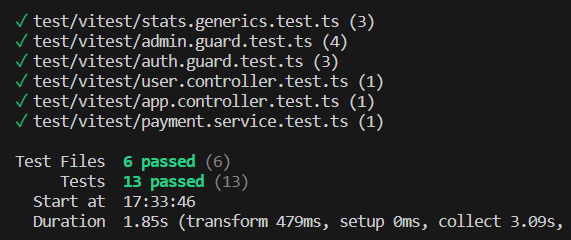
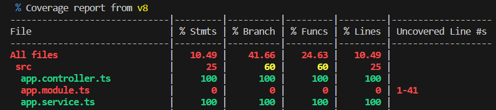
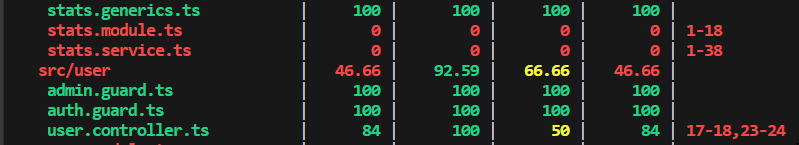

## Overview
 This is an e-commerce backend project, featuring implemented Vitest unit tests. 
 The purpose of this lab is to familiarize with [Vitest](https://vitest.dev/) unit tests.


## Installation

```bash
$ npm install
# vitest install cmd
$ npm install -D vitest
```

## Running the app

```bash
# development
$ npm run start

# watch mode
$ npm run start:dev

# production mode
$ npm run start:prod
```

## Test  with vitest

```bash
# unit tests
$ npm run test
```


```bash
# test coverage
$ npm run test:coverage
```




## Introducing Vitest

### Introduction to Vitest: What is it?
Vitest is a unit testing framework for JavaScript. It provides a simple and expressive syntax for writing unit tests.

### Reasons to Use Vitest for Unit Testing
- Ease of Use: Vitest is easy to learn and use for JavaScript developers.
- Performance: Vitest offers high performance for running unit tests.

### Key Features of Vitest
- Intuitive Syntax: Unit tests with Vitest are written declaratively and are easy to understand.
- Promise Support: Vitest supports asynchronous tests with promises.


